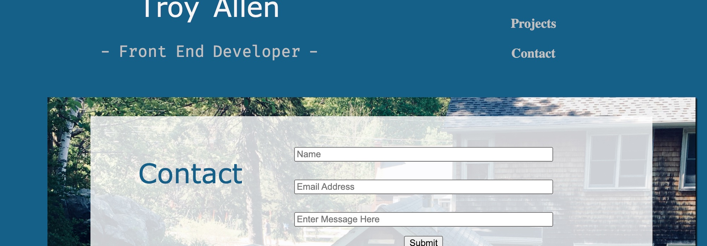

  
  
  # React Portfolio
  ## Description
  Create a portfolio using ReactJS
  
  ## Table of Contents
  - [Installation](#installation)
  - [Usage](#usage)
  - [Contributing](#contributing)
  - [License](#license)
  - [Questions](#questions)
  ## Installation
  npm i
  ## Usage

## Testing

none

## Contributing

open source

## License

This project is protected under MIT License.

[License Documentation](https://opensource.org/licenses/MIT)

## Questions

[Refer to Github Profile: tallen1985](http://www.github.com/tallen1985)

Any additional questions, reach me at my email jake.allen@me.com

## Link and Screenshot

[Github Repo](https://github.com/tallen1985/20-Homework-React-Portfolio)

[Live Site](https://github.com/tallen1985/20-Homework-React-Portfolio)

